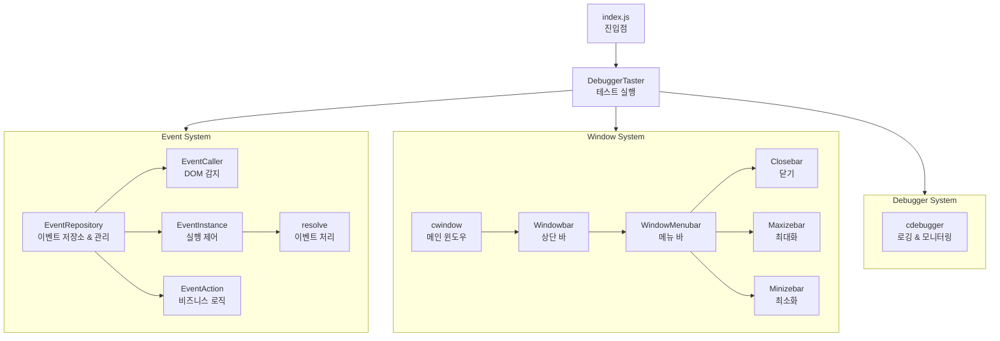

# CodeBox

이벤트 기반 웹 UI 프레임워크


## 개요
모듈형 이벤트 기반 아키텍처를 사용하는 윈도우 시스템 프레임워크

## 아키텍처 플로우 차트




## 모듈 구조

### Event 시스템
- **EventAction**: 비즈니스 로직 단위
- **EventCaller**: DOM 이벤트 감지
- **EventInstance**: 이벤트 실행 제어
- **EventRepository**: 이벤트 저장소

### Window 시스템
- **cwindow**: 메인 윈도우
- **Windowbar**: 상단 바
- **WindowMenubar**: 메뉴 바
- **WindowButtonElement**: 버튼 기본 클래스
- **WindowButtonEvent**: 버튼 이벤트 기본 클래스
- **WindowClosebar/Event**: 닫기
- **WindowMaxizebar/Event**: 최대화
- **WindowMinizebar/Event**: 최소화
- **WindowResizeEvent**: 윈도우 드래그 시 모서리 감지로 크기 조절

### Debugger 시스템
- **cdebugger**: 로깅, 메모리 모니터링, 성능 측정

### Taster 시스템
- **SuperTaster**: 기본 테스터
- **DebuggerTaster**: 디버거 통합 테스터

## 개발 진행도

### 완료 ✅
- [x] 기본 프로젝트 구조
- [x] Event 시스템 기본 클래스 구조
- [x] Window 시스템 클래스 계층
- [x] Debugger 기능 구현
- [x] Taster 기본 기능
- [x] CSS 스타일링

### 진행 중 🔄
- [ ] Event 시스템 bind/unbind/call 메서드 구현
- [ ] WindowResizeEvent: 윈도우 드래그 시 모서리 감지 로직 구현
- [ ] Window element 드래그 핸들링 개선

### 예정 📋
- [ ] Event 인스턴스 고도화
- [ ] Window 인스턴스 고도화
- [ ] Code 해석 인스턴스 개발

## 기술 스택
- JavaScript (ES6+)
- CSS
- ES Modules

## 진입점
```javascript
index.js → DebuggerTaster → 디버거 테스트 실행
```
